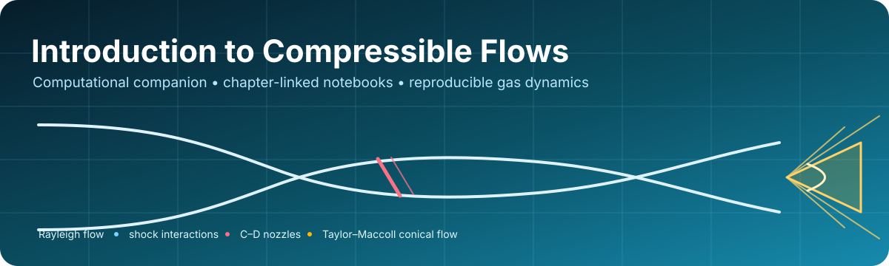

# Introduction to Compressible Flows

[](https://github.com/Ehsan-Roohi/Introduction-to-Compressible-Flows/actions/workflows/notebook-quality.yml)
[](LICENSE)
[](https://www.python.org/)
[](notebooks/README.md)

<p align="center">
  
</p>

This is the open computational companion to the forthcoming textbook **_Introduction to Compressible Flows_** by **Ehsan Roohi**. It connects selected book chapters to executable Python notebooks for Rayleigh flow, oblique shocks, unsteady waves, converging–diverging nozzles, and conical flow.

The manuscript is intentionally not included. This repository publishes the accompanying educational code, numerical demonstrations, and reproducibility guidance.

**New here?** Start with [START_HERE.md](START_HERE.md), or use the [one-click notebook launcher](notebooks/README.md).

## Notebook map

| Book chapter | Notebook | Main concepts | Launch |
| --- | --- | --- | --- |
| **4 — One-Dimensional Flow with Heat Transfer (Rayleigh Flow)** | [Interactive Rayleigh-flow solver](notebooks/chapter04/04_rayleigh_flow_ai_solver.ipynb) | Sonic reference state, heat-addition choking, subsonic/supersonic branches, ML inverse surrogate checked against bisection | [Open in Colab](https://colab.research.google.com/github/Ehsan-Roohi/Introduction-to-Compressible-Flows/blob/main/notebooks/chapter04/04_rayleigh_flow_ai_solver.ipynb) |
| **6 — Oblique Shock Waves and Expansion Waves** | [Emanuel explicit oblique-shock method](notebooks/chapter06/06_01_emanuel_oblique_shock.ipynb) | Weak/strong shock angles, detachment limit | [Open in Colab](https://colab.research.google.com/github/Ehsan-Roohi/Introduction-to-Compressible-Flows/blob/main/notebooks/chapter06/06_01_emanuel_oblique_shock.ipynb) |
| **6 — Oblique Shock Waves and Expansion Waves** | [Shock-polar diagram](notebooks/chapter06/06_02_shock_polar.ipynb) | Velocity-space shock polar, Mach-number dependence | [Open in Colab](https://colab.research.google.com/github/Ehsan-Roohi/Introduction-to-Compressible-Flows/blob/main/notebooks/chapter06/06_02_shock_polar.ipynb) |
| **6 — Oblique Shock Waves and Expansion Waves** | [Oblique-shock collision and slip line](notebooks/chapter06/06_03_oblique_shock_collision_slip_line.ipynb) | Interacting shocks, pressure compatibility, slip-line angle | [Open in Colab](https://colab.research.google.com/github/Ehsan-Roohi/Introduction-to-Compressible-Flows/blob/main/notebooks/chapter06/06_03_oblique_shock_collision_slip_line.ipynb) |
| **7 — Unsteady Wave Motion** | [Shock-tube pressure solver](notebooks/chapter07/07_01_shock_tube_pressure_solver.ipynb) | Incident shock, expansion region, contact-surface matching | [Open in Colab](https://colab.research.google.com/github/Ehsan-Roohi/Introduction-to-Compressible-Flows/blob/main/notebooks/chapter07/07_01_shock_tube_pressure_solver.ipynb) |
| **7 — Unsteady Wave Motion** | [Interacting-shock pressure ratios](notebooks/chapter07/07_02_interacting_shock_pressure_ratios.ipynb) | Nonlinear compatibility equation, bracketed root solve | [Open in Colab](https://colab.research.google.com/github/Ehsan-Roohi/Introduction-to-Compressible-Flows/blob/main/notebooks/chapter07/07_02_interacting_shock_pressure_ratios.ipynb) |
| **8 — Quasi-One-Dimensional Flow in C–D Nozzles** | [Normal-shock location](notebooks/chapter08/08_normal_shock_location_cd_nozzle.ipynb) | Choking, area–Mach relation, total-pressure loss, shock area ratio | [Open in Colab](https://colab.research.google.com/github/Ehsan-Roohi/Introduction-to-Compressible-Flows/blob/main/notebooks/chapter08/08_normal_shock_location_cd_nozzle.ipynb) |
| **10 — Conical Flow** | [Taylor–Maccoll integration from shock angle](notebooks/chapter10/10_01_conical_flow_from_shock_angle.ipynb) | Oblique-shock initialization, RK4 integration, cone-surface condition | [Open in Colab](https://colab.research.google.com/github/Ehsan-Roohi/Introduction-to-Compressible-Flows/blob/main/notebooks/chapter10/10_01_conical_flow_from_shock_angle.ipynb) |
| **10 — Conical Flow** | [Cone shock-angle and property sweep](notebooks/chapter10/10_02_taylor_maccoll_cone_sweep.ipynb) | Taylor–Maccoll ODE, event detection, surface Mach and pressure | [Open in Colab](https://colab.research.google.com/github/Ehsan-Roohi/Introduction-to-Compressible-Flows/blob/main/notebooks/chapter10/10_02_taylor_maccoll_cone_sweep.ipynb) |

Each notebook begins with its chapter association, concepts, learning objectives, execution guidance, model scope, and an interpretation checklist. Repository notebooks are stored without stale outputs so that every displayed result comes from the reader's current inputs and environment.

## Quick start

### Google Colab

Use the **Open in Colab** link beside any notebook. Colab already supplies most packages; if an import is missing, run:

```python
%pip install -r https://raw.githubusercontent.com/Ehsan-Roohi/Introduction-to-Compressible-Flows/main/requirements.txt
```

### Local Python

```bash
git clone https://github.com/Ehsan-Roohi/Introduction-to-Compressible-Flows.git
cd Introduction-to-Compressible-Flows
python -m venv .venv
source .venv/bin/activate  # Windows PowerShell: .venv\Scripts\Activate.ps1
python -m pip install --upgrade pip
python -m pip install -r requirements.txt
jupyter lab
```

Python 3.12 is the reference environment; automated checks also cover Python 3.10 and 3.11.

## Scientific-use contract

These notebooks are teaching implementations, not certified design software.

1. Run a notebook from a fresh kernel, top to bottom.
2. Keep units explicit and record all input values, `gamma`, tolerances, and grid/sweep resolution.
3. Check limiting behavior and physical admissibility—not only solver convergence.
4. Treat analytical or conservation-law results as the reference when a learned surrogate is present.
5. Repeat numerical studies at tighter tolerances before using a result in research or design.
6. Cite the repository version or commit used to produce a figure or table.

The repository quality workflow checks notebook JSON, Python syntax, chapter metadata, Colab links, clean execution state, portable paths, and a representative numerical smoke-test set.

## Repository structure

```text
Introduction-to-Compressible-Flows/
├── notebooks/                 # Chapter-organized executable notebooks
├── scripts/                   # Notebook preparation, validation, and smoke tests
├── assets/                    # README visual assets
├── .github/                   # CI and issue templates
├── START_HERE.md              # Shortest path for readers
├── CITATION.cff               # GitHub/Zenodo-ready citation metadata
├── CONTRIBUTING.md            # Contribution and scientific-change rules
└── requirements.txt           # Reproducible Python environment
```

## Relationship to FlowMLLab

The repository organization adopts lessons from [FlowMLLab](https://github.com/Ehsan-Roohi/FlowMLLab): a visible entry point, one-click notebook launch, explicit scientific scope, clean notebooks, machine-readable metadata, citation support, issue templates, and automated release checks. The two projects remain separate: FlowMLLab focuses on reproducible CFD-to-scientific-machine-learning experiments, while this repository follows the chapter structure of the compressible-flow textbook.

## Citation and contact

The current software release is **v0.1.0**; see the [release notes](RELEASE_NOTES_v0.1.0.md). Please use [CITATION.cff](CITATION.cff) when citing the software. Until the book and repository receive final publication identifiers, cite the repository version or commit and access date.

**Ehsan Roohi**<br>
Department of Mechanical and Industrial Engineering<br>
University of Massachusetts Amherst<br>
[roohie@umass.edu](mailto:roohie@umass.edu)

Copyright © 2026 Ehsan Roohi. Code is released under the [MIT License](LICENSE).
